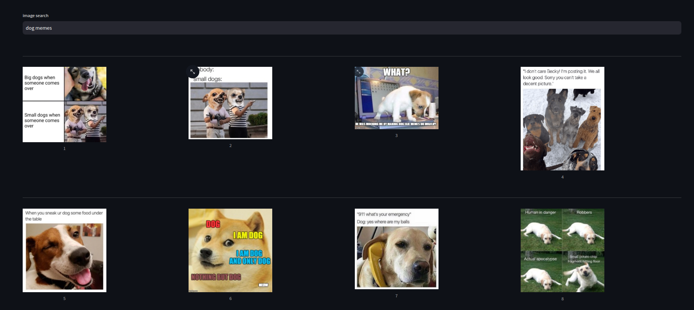
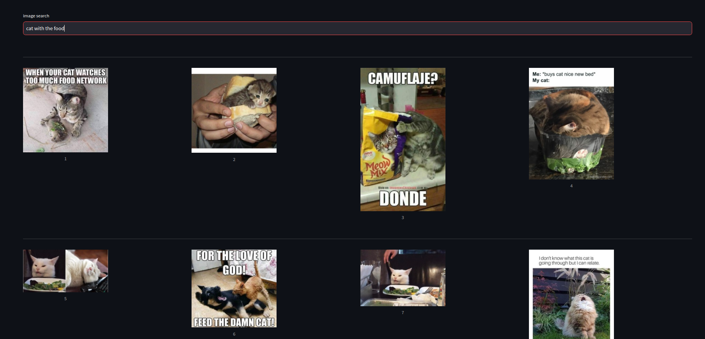
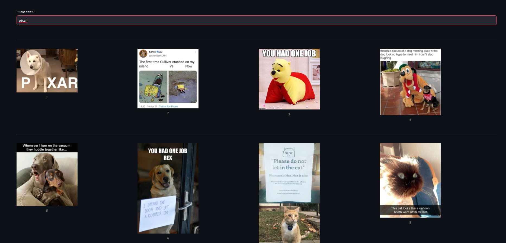
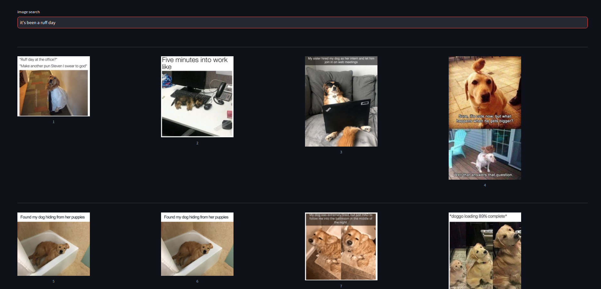

# pets meme search

Instantly elevate your humor by sending the perfect meme with one search.


Text2image search system:
- downloads around 800 images using duckduckgo API for images
- uses [clip-ViT-B-32](https://huggingface.co/sentence-transformers/clip-ViT-B-32) to embed text and images in same vector space
- qdrant vector database for storing and finding most similar vectors
- simple streamlit app for GUI


## TODO
- [ ] remove duplicate images
- [ ] run streamlit and preprocessing in container
- [ ] use ocr to detect text from image to improve search quality
- [ ] more data

## dataset exploration
Data is downloaded using duckduckGO API

Data exploration can be found inside [`meme2_analysis.ipynb`](./meme2_analysis.ipynb)

## How to run app:

1. run qdrant-db container
```sh
docker compose up qdrant-db -d
```

2. download, preprocess and insert data into vector database
```sh
pip install -r requirements.txt
python3 preprocess.py

```

3. run streamlit frontend
```sh
cd frontend
streamlit run streamlit.py
```

4. search memes on [localhost:8501](http://localhost:8501)


## query examples

### good query examples

### query: dog memes


### query: cat with the food


### query: pixar


### query: showering


### bad query examples

Bad search examples usually involves searching memes by text on the image

This can be solved by using OCR and searching in both spaces(image and text)

### query: it's been a ruff day


### image from the dataset we wanted to retrieve


## system evaluation

One of ways to evaluate this system would be to create dataset with pairs (query, image). The Query should be tailored specifically for the image. We expect that pair to have the best similarity metric, compared with the same query with other images from dataset.

We would use `recall@1` as an evaluation metric. If multiple images matches single query, we can use some of the metrics that also capture the ranking of results, like `mAP@n` or `nDCG@n`.
